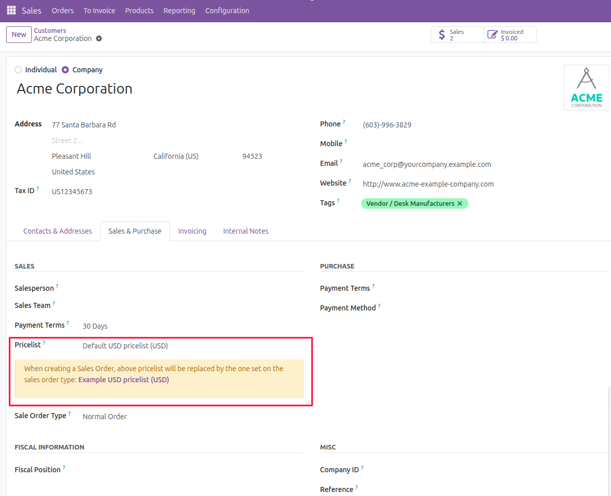

This module adds a typology for the sales orders. In each different
type, you can define, invoicing and refunding journal, a warehouse, a
stock route, a sequence, the shipping policy, the invoicing policy, a
payment term, a pricelist and an incoterm.

You can see sale types as lines of business.

You are able to select a sales order type by partner so that when you
add a partner to a sales order it will get the related info to it.

Additionally, it adds a warning message to notify users when there is a mismatch between the partner's default pricelist
and the effective pricelist set by the sales order type. This ensures clarity when creating sales orders, as the
effective pricelist (determined by the sales order type) will take precedence over the partner's default pricelist.
The warning is only visible for companies without a parent and when there is a mismatch between the two pricelists.

